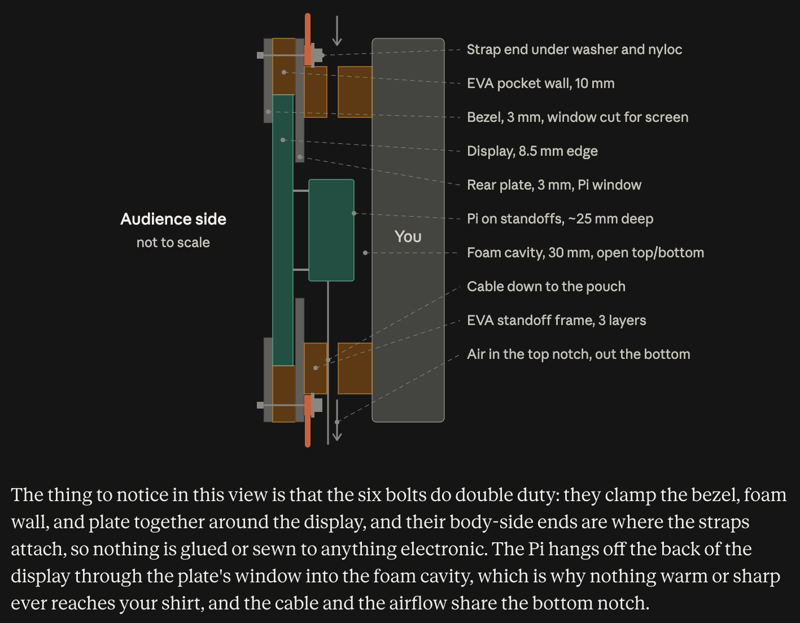
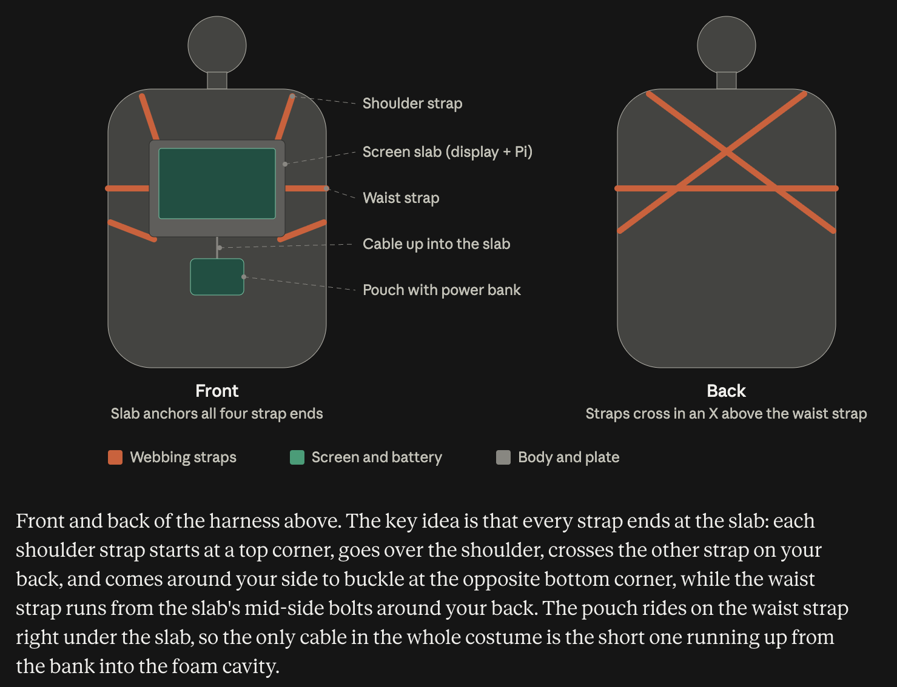

# VLC Media Player Costume — BOM & Build Plan

*Keep `harness_diagram1.png` and `harness_diagram2.png` in the same folder as this file so the diagrams show in the preview.*

**Concept:** a rigid chest slab (7" touchscreen with a Raspberry Pi bolted to its back) worn on a shoulder-and-waist harness, powered by a USB-C bank in a pouch on the waist strap, auto-booting into a maximized, looping, muted VLC window. Foam traffic-cone hat on top (your build).

**Design rules**

1. **One rigid module.** The two fragile links (DSI ribbon, GPIO power lead) live inside a bolted sandwich and never see strain.
2. **One cable.** Bank → Pi, 30 cm, right-angle, strain-relieved twice.
3. **Plug in = costume on.** Everything autostarts. Read-only filesystem, so yanking power at 2 a.m. is harmless.
4. **Nothing touches you but foam.** The Pi sits in a vented foam cavity behind the plate.

---

## Platform: Raspberry Pi 4

2 GB is plenty; 4 GB is fine if that's what you have. Budget ~7–8 W with the display playing video. It runs from any USB-C bank that can do 5 V/3 A, and it decodes H.264 in hardware, so 720p playback is nearly free.

---

## Bill of materials

Prices are rough USD; check current pricing.

### Electronics

| Item | Spec / notes | Qty | Est. |
|---|---|---|---|
| Raspberry Pi 4 Model B, 2 GB | | 1 | $45 |
| Raspberry Pi Touch Display 2, 7" | DSI, powered from GPIO, 720×1280 portrait-native. Box includes two DSI cables (the 15-way to 15-way one is the Pi 4's), the GPIO power lead, and 8× M2.5 screws | 1 | $60 |
| microSD card | 32 GB, A1/A2 class | 1 | $10 |
| Stick-on heatsink kit for Pi 4 | Fit before mounting the Pi | 1 | $5 |
| USB-C power bank | 10,000–20,000 mAh. **USB-C output rated 5 V / 3 A** (PD is fine, not required). See Phase 0 for sizing | 1 | $25–45 |
| Right-angle USB-C to USB-C cable | 30 cm, rated 3 A / 60 W. Buy two — one is the spare in your pocket | 2 | $16 |
| USB-C inline power meter | Optional but worth it: it turns "will it last?" into a number | 1 | $15 |
| USB keyboard + mouse | Setup only | — | own |

### Content

| Item | Spec / notes | Qty | Est. |
|---|---|---|---|
| Video clips | 1–3 minutes each, 30–45 minutes in total. Any format; you convert them in Phase 1. Trailers, short films, your own footage, or public-domain material from the Internet Archive / Prelinger collections | 15–20 | free |

### Chest module

| Item | Spec / notes | Qty | Est. |
|---|---|---|---|
| Rear plate | 3 mm PVC foam board (Sintra), 3 mm plywood/hardboard, or 3 mm acrylic, cut to 240 × 170 mm | 1 | $8 |
| Front bezel | 3 mm black PVC or 5 mm black foam board, same outline | 1 | $5 |
| EVA foam, 10 mm | Interlocking floor-tile 4-pack. Pocket wall, body standoff frame, strap pads — and material for the cone hat | 1 pack | $15 |
| Black gaffer tape, 2" | Bezel finish, edge sealing, cable dressing | 1 | $12 |
| M3 × 25 mm bolts, nyloc nuts, M3 fender washers | Clamp the sandwich and anchor the straps | 10 | $6 |
| Thin foam tape, 1–2 mm | Cushion between bezel and glass | 1 roll | $4 |
| Zip ties, 4" | Strain relief | 10 | $3 |
| Contact cement (or hot glue) | EVA to EVA and EVA to plate | — | own |

### Harness

| Item | Spec / notes | Qty | Est. |
|---|---|---|---|
| 1" nylon webbing | 5 yards | 1 | $8 |
| 1" side-release buckles | Two shoulder, one waist | 3 | $6 |
| 1" tri-glide sliders | Length adjustment | 3 | $3 |
| Small pouch / fanny pack | Threads onto the waist strap, holds the bank directly under the slab | 1 | $10 |
| *Alternative:* GoPro-style chest harness | Replaces the webbing; bolt the plate to its mount | 1 | $15 |

**Total buying everything new: ~$240–290.** If you already own a Pi, bank, and SD card: ~$150.

### Tools

- Hobby knife and cutting mat
- Steel rule, plus calipers or a ruler
- Drill with 3 mm and 4 mm bits
- #1 Phillips screwdriver
- Hot glue gun
- Lighter (to seal webbing ends)
- microSD card reader
- A computer with Raspberry Pi Imager and ffmpeg (Phase 1 walks through installing both)
- Optional: an SSH app on your phone (Termius, Blink)
- Optional: a laser cutter or 3D printer for a cleaner plate and bezel

### Key dimensions (7" Touch Display 2)

- Outline 120 × 189.5 mm; edge thickness ~8.5 mm; max depth ~15 mm at the driver board and connectors.
- Viewing area 88 × 155.5 mm.
- Pi 4 board 85 × 56 mm. Slab depth with the Pi mounted, glass to the top of the USB ports: ~40 mm. **Measure your assembled unit before cutting anything.**
- Weight on the chest: display ~250 g + Pi ~50 g + plate and foam ~150 g ≈ 450 g. The bank (200–450 g) rides on the waist strap.

### Cross-section, front to back

The chest module is a sandwich. Reading from the audience's side toward your body:

| # | Layer | Thickness | What it does |
|---|---|---|---|
| 1 | Bezel (black PVC or foam board) | 3 mm | Frames the screen, hides the display's edges |
| 2 | EVA pocket wall | 10 mm | Ring the display sits inside so it can't slide |
| 3 | Display slab (Touch Display 2 with the Pi bolted to its back) | 8.5 mm at the edge, ~40 mm including the Pi | The costume |
| 4 | Rear plate (PVC or plywood) | 3 mm | The backbone; bolts and straps anchor here; the Pi pokes through a window cut in it |
| 5 | EVA standoff frame | 30 mm | Cavity around the Pi, open at the top and bottom for air, so nothing hot or sharp touches you |
| 6 | Your shirt | — | |



*Side view, audience on the left and you on the right. The bolts pass through bezel, foam wall, and plate; each strap end is trapped under a washer and nyloc nut on the body side. The Pi sits in the foam cavity, and the cable and airflow share the bottom notch.*

---

## Phase 0 — Decide and order (do this week)

1. **If your Pi 4 is an older one**, check the revision: `grep Revision /proc/cpuinfo`. A code ending in `3111` (a03111 / b03111 / c03111) is a 2019 rev 1.1 board, which won't power up from e-marked USB-C cables. Buy a USB-A to USB-C cable instead of C-to-C.
2. **Size the bank.** Wh needed ≈ watts × hours × 1.25 (headroom). At 8 W for a 5-hour night ≈ 50 Wh ≈ 13,500 mAh → buy 20,000 mAh. For 3 hours, 10,000 mAh is enough. Slim/flat form factor sits better in the pouch.
3. **Order everything**, including two cables. Lead time is nothing; the build is a weekend plus a soak test.

---

## Phase 1 — Bench bring-up (software) — ~3 hours, plus conversion time

Do this on a proper Pi wall supply with a USB keyboard and mouse plugged into the Pi. Don't enable the read-only filesystem until Phase 6.

**Four terminal basics, and that's all you need:**

- **Open a terminal on the Pi:** click the black terminal icon in the top bar, or press Ctrl+Alt+T. Type a command, press Enter. Paste with Ctrl+Shift+V.
- **`sudo`** in front of a command means "do this as administrator." It may ask for your password; nothing appears while you type it, which is normal.
- **`nano`** is a text editor that runs inside the terminal. Type or paste your text, press Ctrl+O then Enter to save, then Ctrl+X to exit.
- Wherever you see **`katie`** in a path, use your own username (the one you set in Imager). Not sure? Type `whoami`.

**Step 1 — Flash the card.** On your computer, install Raspberry Pi Imager from raspberrypi.com/software and insert the microSD card. In Imager: Choose Device → Raspberry Pi 4. Choose OS → Raspberry Pi OS (64-bit). Choose Storage → your card. Next → **Edit Settings**. General tab: hostname `vlc`; a username and password; your home Wi-Fi name and password; your time zone. Services tab: **Enable SSH**, "Use password authentication". Save → Yes → Yes. Wait for "Write successful", then take the card out.

**Step 2 — Stick the heatsinks on** the Pi before it goes on the display.

**Step 3 — Build the display slab.**

- Use the 15-way to 15-way DSI cable (the 22-way one in the box is for Pi 5; set it aside).
- Seat it in the display's DSI connector and the Pi's, contacts oriented as shown in the display's leaflet, latches closed. Wrong-way ribbon is the number one cause of a black screen.
- GPIO power lead: red → 5 V (pin 2 or 4), black → GND (pin 6).
- Bolt the Pi to the display's standoffs with the included M2.5 screws.
- Put a dot of hot glue over the lead's header connector so it can't walk off the pins.

**Step 4 — First boot.** Card into the Pi, keyboard and mouse into the USB ports, wall supply in. The display is auto-detected; you'll see the desktop in about a minute. Open a terminal and run `sudo apt update && sudo apt full-upgrade -y` (10–20 minutes), then `sudo reboot`.

**Step 5 — Rotate to landscape.** Menu (raspberry icon, top left) → Preferences → Screen Configuration → right-click the DSI-1 box → Orientation → Right or Left → Apply. Choose the direction that puts the Pi's USB-C port toward the **bottom or a side** of the landscape picture (the cable will exit through the bottom of the foam cavity). Touch input rotates with it.

**Step 6 — Screen blanking off.** Run `sudo raspi-config` (a blue text menu: arrow keys to move, Enter to select, Tab to reach Finish) → Display Options → Screen Blanking → No → Finish.

**Step 7 — Taskbar.** Right-click the panel → Panel Preferences → turn on auto-hide if your panel version has it. If it doesn't, leave it: a desktop taskbar above the VLC window still reads as real.

**Step 8 — Optional: phone hotspot + SSH.** The finished costume has no keyboard, so this is the only way to get a terminal into the Pi at the party (check temperature, restart VLC, dim the backlight) without plugging anything in. Turn on your hotspot, join it from the network tray icon so it's saved, then test from your phone: `ssh katie@vlc.local` (your username). Skip it if you'd rather keep things simple — once the filesystem is read-only in Phase 6, unplug/replug is a perfectly safe reboot.

**Step 9 — Choose your clips.** Target **15–20 clips, 1–3 minutes each, 30–45 minutes in total.** Why those numbers: a clip has to be short enough that the seek bar visibly moves and the filename changes often, but long enough that it doesn't look like a GIF restarting; two minutes is the sweet spot. 30–45 minutes of material means even the friends who sit next to you all night won't notice the loop. Trailers and short films are ideal raw material, and the Internet Archive's public-domain and Prelinger collections are a deep well. Put every clip in one folder on your computer's Desktop named `clips`, and **rename each file to its joke name now** — VLC shows the filename in the title bar and flashes it at the start of each clip. Use letters, numbers, spaces, and hyphens only. Any video format is fine at this stage.

**Step 10 — Install ffmpeg on your computer** (one time; it's the converter). Mac: open Terminal and run `brew install ffmpeg` (no Homebrew yet? Paste the one-line installer from brew.sh first). Windows: open PowerShell and run `winget install Gyan.FFmpeg`, then close and reopen PowerShell. Check: `ffmpeg -version` should print a version number.

**Step 11 — Convert one clip as a test.** Every clip gets shrunk to 1280×720 (the panel's size) with the audio stripped out. In the terminal, go into the folder with `cd ~/Desktop/clips`, then make an output folder next to it with `mkdir ../ready`. Now run this one line, with your clip's name in both places:

```
ffmpeg -y -i "My Clip.mp4" -vf "scale=1280:720:force_original_aspect_ratio=decrease,pad=1280:720:(ow-iw)/2:(oh-ih)/2" -c:v libx264 -crf 22 -pix_fmt yuv420p -an "../ready/My Clip.mp4"
```

Play the new file in `ready`: it should be silent and 1280×720. To use only part of a long video, add `-ss 00:01:30 -t 00:02:00` right after `ffmpeg -y` (start at 1:30, keep 2 minutes).

**Step 12 — Convert everything.** Still in the `clips` folder, run one of these. It converts every file in the folder, roughly 1–2 minutes per clip on a laptop, so go make coffee.

Mac / Linux:

```
for f in *; do ffmpeg -y -i "$f" -vf "scale=1280:720:force_original_aspect_ratio=decrease,pad=1280:720:(ow-iw)/2:(oh-ih)/2" -c:v libx264 -crf 22 -pix_fmt yuv420p -an "../ready/${f%.*}.mp4"; done
```

Windows PowerShell:

```
Get-ChildItem -File | ForEach-Object { ffmpeg -y -i $_.FullName -vf "scale=1280:720:force_original_aspect_ratio=decrease,pad=1280:720:(ow-iw)/2:(oh-ih)/2" -c:v libx264 -crf 22 -pix_fmt yuv420p -an "../ready/$($_.BaseName).mp4" }
```

When it finishes, `ready` should hold one `.mp4` per clip, roughly 30–60 MB each.

**Step 13 — Copy the clips to the Pi.** A USB stick is the easy way: copy the `ready` folder onto it. On the Pi, open the file manager (folder icon in the top bar); in your home folder right-click → New Folder → name it `videos`. Plug the stick in, choose "Open in File Manager", select all the `.mp4` files, and drag them into `videos`. (Alternative from a Mac/Linux terminal, one time only: `scp -r ready katie@vlc.local:videos` — this creates the `videos` folder for you.)

**Step 14 — Make the playlist.** In a Pi terminal: `ls ~/videos/*.mp4 > ~/videos/playlist.m3u` and then `cat ~/videos/playlist.m3u`. You should see every clip listed with its full path, one per line. If the list is empty, the files aren't in `videos` or don't end in lowercase `.mp4`.

**Step 15 — First VLC run by hand.** Menu → Sound & Video → VLC Media Player. Dismiss the privacy/network policy dialog (if you skip this, it'll pop up on the party boot). Then Tools → Preferences:

- Interface: **uncheck "Resize interface to video size"**; set "Continue playback?" to Never.
- Audio: uncheck "Enable audio".
- Click Save.

Then Media → Open File → Home → videos → `playlist.m3u` (switch the file-type dropdown to All Files if you don't see it) → Open. Click the loop button in the bottom controls (two arrows forming a circle) once so it highlights. **Maximize** the window with the maximize button — not fullscreen; you want the title bar and controls visible. Let it play for a minute, then press **Ctrl+Q** to quit cleanly so VLC saves the window state.

**Step 16 — Autostart.** In a terminal: `mkdir -p ~/.config/labwc` and then `nano ~/.config/labwc/autostart`. Paste this single line (your username, not `katie`), save, exit:

```
vlc --loop --random --no-audio --no-qt-video-autoresize /home/katie/videos/playlist.m3u &
```

What it means: `--loop` repeat forever, `--random` shuffle the order on every boot, `--no-audio` mute, `--no-qt-video-autoresize` keep the window size, `&` let the desktop finish loading. (Older Bookworm images still on Wayfire: put `vlc = vlc --loop --random --no-audio --no-qt-video-autoresize /home/katie/videos/playlist.m3u` under `[autostart]` in `~/.config/wayfire.ini`.)

**Step 17 — Reboot and verify.** `sudo reboot`. Within about 40 seconds VLC should appear maximized, silent, playing a random clip. If it comes up un-maximized: `nano ~/.config/labwc/rc.xml`. If the file is empty, paste all of this; if it already has text, paste only the `<windowRules>…</windowRules>` part on the lines just above the final `</labwc_config>`. Save, exit, `sudo reboot`.

```
<?xml version="1.0"?>
<labwc_config>
  <windowRules>
    <windowRule identifier="vlc">
      <action name="Maximize"/>
    </windowRule>
  </windowRules>
</labwc_config>
```

**Step 18 — Cursor.** Unplug the mouse and keyboard when you're done. With no pointer device the desktop won't draw a cursor, and the touchscreen does everything you need.

**Step 19 — Optional: dim the backlight** for battery and glare. `cat /sys/class/backlight/*/max_brightness` prints the maximum (often 255). Then `sudo crontab -e` (the first time, it asks which editor — press 1 for nano), go to the bottom, add this line (adjust 150 to taste), save, exit:

```
@reboot sleep 15; for b in /sys/class/backlight/*; do echo 150 > $b/brightness; done
```

---

## Phase 2 — Power validation — ~1 hour plus a soak

1. Charge the bank fully.
2. Chain it: bank USB-C → inline meter → right-angle cable → Pi. Boot with VLC playing.
3. **Watch the top-right corner** for the lightning-bolt / low-voltage warning. If it appears: use the bank's USB-C port (not USB-A), a shorter or better cable, or a better bank.
4. Read steady-state watts after 5 minutes. **Runtime ≈ (mAh × 3.7 ÷ 1000 × 0.8) ÷ watts.** Example: 20,000 mAh → 59 Wh usable → ~7 h at 8 W.
5. **Soak 30+ minutes.** The bank must stay on with no reboots or flicker. Then wiggle the cable at the Pi's port: if the screen so much as blinks, that connector gets the double strain relief in Phase 4 (it should anyway).
6. **One full-length run** before Halloween while you do something else. Write down the real runtime.

---

## Phase 3 — Chest module — 3–4 hours

Layers, front to back: bezel → EVA pocket wall → display slab → rear plate → EVA standoff frame → you.

1. **Cut the rear plate:** 240 × 170 mm, corners rounded R10. Mark the display outline (189.5 wide × 120 tall, landscape) centered on it.
2. **Cut the Pi window in the plate.** Set the assembled slab face-down on the plate, trace around the Pi, the DSI connector, and the power lead, add 5 mm clearance all around, and cut it out. Everything on the display's back that stands proud of the rear frame must pass through this window so the plate sits flat against the display.
3. **Cut the front bezel:** same 240 × 170 outline, with a 95 × 162 mm window centered. That's 7 mm bigger than the viewing area, so ~3.5 mm of the display's own black border shows behind the bezel edge and alignment isn't critical. Wrap the window edge and the outer edge in gaffer tape.
4. **Cut the pocket wall** from 10 mm EVA: same outline, inner cutout 121 × 191 mm (display outline + 1 mm). Contact-cement it to the back of the bezel, aligned to the outline.
5. **Cushion.** Run foam tape around the inside face of the bezel window (where it meets the glass) and around the plate where it meets the display's rear frame. The 8.5 mm display edge sits inside the 10 mm wall; the tape takes up the slack so nothing rattles or clamps directly on glass.
6. **Dry-fit:** bezel-and-wall face down, drop the display in (glass toward the bezel, Pi up), lay the plate on top with the Pi through its window. Check that the plate sits flat. If it doesn't, enlarge the window.
7. **Drill and bolt.** Eight 3 mm holes through the whole stack in the wall zone, outside the display outline, ~12 mm in from the outer edge: three across the top edge (left, center, right), three across the bottom, and one on each side edge at mid-height. Bolt with M3 × 25, washers under the heads on the bezel side, nyloc nuts on the body side. **Snug, not crushed** — EVA compresses. Leave the four corner nuts and the two side nuts off for now; the straps go under them in Phase 4.
8. **Standoff frame.** From 10 mm EVA cut three identical frames: outer 215 × 145 mm, inner 170 × 100 mm (so the frame sits inboard of the bolt line). Stack and cement them into a 30 mm deep ring, then cut a 40 mm notch out of the middle of the top bar and the bottom bar — those are the vents, and the bottom one is where the cable exits. Cement the ring to the body side of the plate, centered on the Pi window. The Pi now lives in a 30 mm cavity and can't touch you. Want a slight upward tilt so people see the screen at a glance? Add one extra layer to the bottom bar only.
9. **Airflow check:** with the ring on, you should be able to see daylight through the top notch, past the Pi, and out the bottom notch.

---

## Phase 4 — Harness and cable — ~1.5 hours

Straps anchor under the plate bolts: fold the webbing end over twice, melt a 3 mm hole through it with a heated nail, drop it over the bolt, then fender washer and nyloc on top.



*Front and back. Each shoulder strap starts at a top corner of the slab, goes over the shoulder, crosses the other strap on your back, and buckles at the opposite bottom corner. The waist strap runs from the mid-side bolts around your back, and the pouch rides on it directly under the slab.*

1. **Shoulder straps.** Cut two 1.2 m lengths, seal the ends with a lighter. Anchor one end of each at a **top corner** bolt. Each strap goes up over the shoulder, diagonally across the back (crossing the other one, which keeps them from slipping off), around the side, and clips into a buckle tail anchored at the **opposite bottom corner** bolt. Put a tri-glide on each strap for adjustment; leave the bottom anchors loose enough to rotate.
2. **Waist strap.** Cut ~1 m. Anchor a short buckle tail at one **mid-side** bolt and the long piece with the other buckle half at the other, running around your back at the bottom of the ribcage. This strap is what stops the slab from swinging when you walk or lean. Thread the pouch onto it before you buckle it.
3. **Fit.** Put it on over the clothes you'll wear. The top of the screen should sit just below the collarbones. Adjust so the plate is snug but you can breathe; add strips of 10 mm EVA under the straps at the shoulders if they dig.
4. **Bank and cable.** Bank in the pouch on the waist strap, directly below the slab, USB-C port facing up. Right-angle cable from the bank up through the bottom vent notch to the Pi. Strain relief twice: first, zip-tie the cable to the standoff frame (punch a hole through the EVA) about 4 cm from the Pi's plug, leaving a small loop of slack between the tie and the plug so the plug itself carries zero tension; second, zip-tie or tape the cable again at the bottom edge of the plate where it exits, so a tug on the pouch is stopped there. Then dress the cable along the waist strap with gaffer tape down to the pouch.
5. **Yank test.** Pull the pouch away from your body, hard, while the display is running. The screen should not flicker. If it does, the plug is carrying tension — redo the slack loop.

---

## Phase 5 — Wear test — ~1 hour

1. Boot it, put it on, and walk around for 20–30 minutes: stairs, sitting down, bending over, a doorway hug.
2. Check: swing (tighten the waist strap), strap dig-in (pad), screen angle (add a bottom layer to the ring), heat (feel the back of the plate; if you set up SSH, `vcgencmd measure_temp` — under 70 °C is fine, throttling starts at 80), and whether anything on the body side is touching you.
3. Check the bank stays put in the pouch and the cable is invisible from the front.
4. Fix, then repeat once. Then leave it alone — the last thing to change before the party is the thing that will fail.

---

## Phase 6 — Lockdown — 15 minutes

Do this last, after every software tweak, because the next step makes the card read-only.

1. `sudo raspi-config` → Performance Options → Overlay File System → enable, and write-protect the boot partition when asked. Reboot.
2. Verify VLC still autostarts. From now on, cutting power at any time cannot corrupt the card. To change anything later: raspi-config → disable overlay → reboot → change → re-enable.
3. Boot-from-cold test: unplug, wait 5 seconds, plug in. Time it. That's your party reboot procedure.

---

## Halloween checklist

- ☐ Bank charged to 100%; spare cable and a spare 10,000 mAh bank if you have one
- ☐ Two-minute power-on test at home before leaving, hat on, slab on
- ☐ If you set up SSH: hotspot on, SSH app ready. Either way, unplug/replug is a safe reboot once the filesystem is read-only
- ☐ Pocket kit: #1 Phillips, three zip ties, a strip of gaffer tape
- ☐ Leave the mouse at home — the touchscreen is the interface. Let people pause you.

---

## Troubleshooting

| Symptom | Likely cause → fix |
|---|---|
| Black screen, Pi boots | DSI ribbon backwards or unseated; power lead on the wrong pins; wrong cable for your Pi model |
| Lightning bolt / low-voltage warning | Bank's USB-A port instead of USB-C; thin or long cable; weak bank |
| Pi 4 won't power up on C-to-C cable | Rev 1.1 board → USB-A to C cable |
| VLC opens but not maximized | Add the labwc window rule (Phase 1, step 13) |
| Window shrinks to the video's size on each clip | "Resize interface to video size" is still on |
| A dialog covers the video at boot | Privacy dialog or "Continue playback?" wasn't dismissed/disabled before lockdown |
| Cursor on screen | A pointer device is plugged in |
| Bank turns itself off | Rare at this draw — almost always a cable blip → redo strain relief; try the other cable |
| Pi runs hot / stutters | Blocked vent notches; no heatsink; drop backlight; check `vcgencmd measure_temp` |
| Touch is mapped wrong after rotation | Screen Configuration → Touchscreens → assign to DSI-1 |
| Changes don't persist | Overlay filesystem is enabled — disable, change, re-enable |
| `playlist.m3u` is empty | Files aren't in `~/videos`, or don't end in lowercase `.mp4` |
| VLC plays one clip and stops | The autostart line is missing `--loop` (or, testing by hand, the loop button is off) |
| A clip has sound or the wrong size | It skipped conversion — every file in `videos` must come from the `ready` folder |
